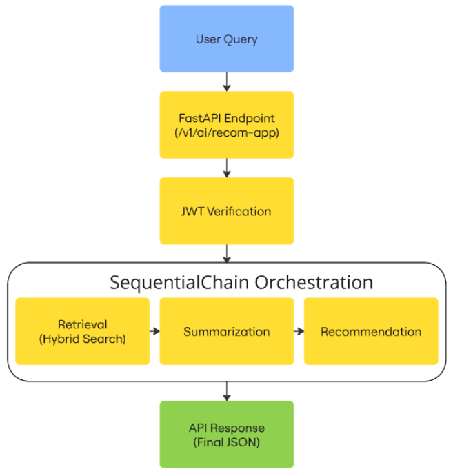

# **Shopify App Recommendation Agent**

The Shopify App Recommendation Agent is an AI-powered **REST API** designed to help find the best apps for business needs. It leverages a multi-step **Retrieval-Augmented Generation (RAG)** pipeline using **LangChain** to combine semantic search (via **Chroma**) with natural language generation (via **OpenAI**). **JWT-based** authentication secures the API endpoints.

## **Project Structure & Architecture**

```sh
project_root/
├── app/
│   ├── __init__.py
│   └── main.py                # FastAPI application endpoints
├── chains/
│   ├── __init__.py
│   ├── langchain_agent.py     # Orchestration: retrieval, summarization, and recommendation chains
│   └── retrievecontext.py     # Custom RetrievalChain (hybrid search)
├── data/
│   ├──dataset/
│   │  ├──apps.csv             # Shopify apps dataset
│   │  ├── categories.csv      # App categories
│   │  └── apps_categories.csv # Mapping of apps to categories
│   ├── __init__.py
│   └──data_index.py           # Data processing, merging CSVs, and indexing in Chroma                    
├── auth/
│   ├── __init__.py
│   └── security.py            # JWT token creation and verification
├── tests/
│   ├── __init__.py
│   ├── test_auth.py           # Simple authorization test
│   └── test_api.py            # Automated API tests using FastAPI's TestClient
├── assets/
│   └── flow_diagram.png
├── .env                       # Environment configuration file (not committed)
├── requirements.txt           # Python dependencies
├── Dockerfile 
└── README.md                 
```

---

## **Flow Diagram**

Below is a diagram illustrating how a user query is processed by the system:



---

## **How to Run**

First **make sure to get** `OPENAI_API_KEY` and put it into the docker run command as below:

(Also it is notable that .env file is added to this repo only for a better clarification)

```sh
docker pull mohammada130/spoki
sudo docker run -p 80:80 -e OPENAI_API_KEY=<PLEASE PUT YOUR OPENAI_API_KEY HERE> mohammada130/spoki
```

---

### **Data Indexing**

To process and index the data (merging app and category information), run:

```sh
python data/data_index.py
```
This script loads the CSV files, enriches the app data with category information, and indexes the resulting dataset in a persistent Chroma database located at `./chroma_db`.

---

### **Running the API**

Start the FastAPI server using Uvicorn:

```sh
uvicorn app.main:app --reload
```
Your API will be available at `http://127.0.0.1:8000`, and you can access the interactive Swagger UI at `http://127.0.0.1:8000/docs` or `http://127.0.0.1:8000/redoc`.

---

### **Testing**

You can run automated tests without starting the server using FastAPI's TestClient. From the project root run:

```sh
python tests/test_api.py
```
---

### **Technologies and Rationale**
This project is built with:

- **FastAPI**: Chosen for its asynchronous capabilities, ease of development, and robust performance.
- **LangChain**: Used to orchestrate the multi-step RAG pipeline that includes retrieval, summarization, and recommendation generation.
- **OpenAI API**: Provides advanced natural language capabilities for generating embeddings and responses.
- **Chroma**: A lightweight, Python-native vector database for semantic search.
- **JWT (PyJWT)**: Implements secure authentication for API endpoints.
- **Pandas**: Used for efficient data processing and merging CSV files.

---